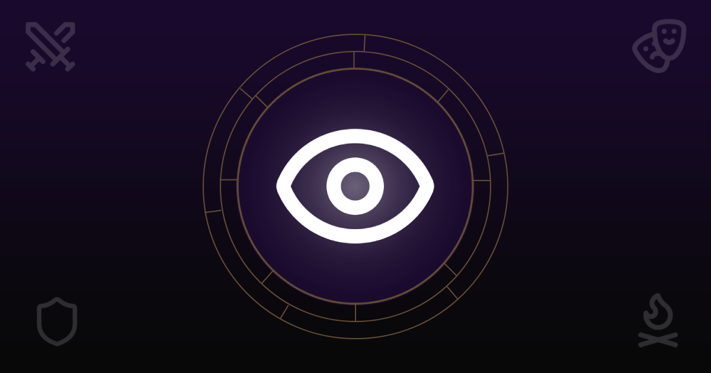
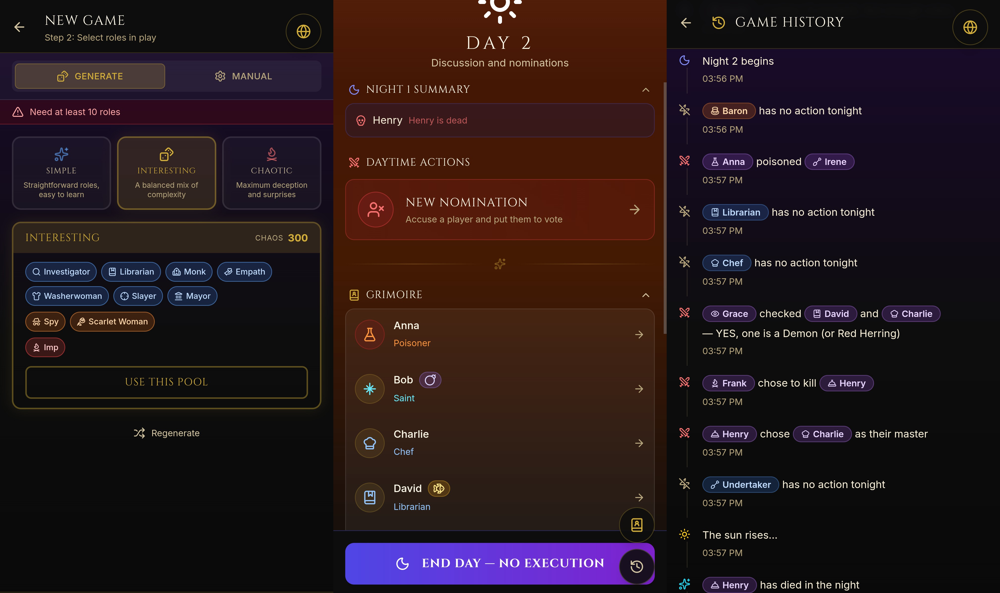
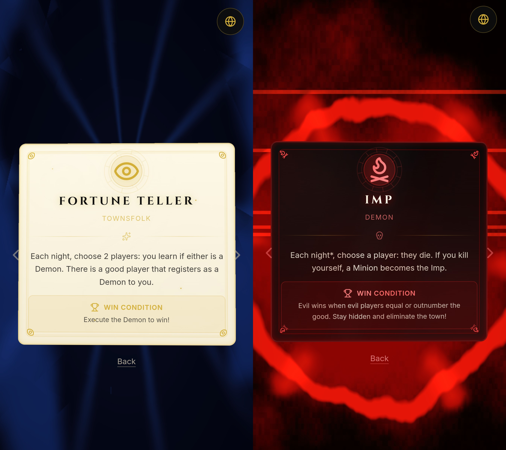

# Grimorium

> A fully digital Grimoire for Blood on the Clocktower.

<p align="center">
  
</p>

<p align="center">
  🕯️ <a href="https://grimorium.app"><strong>grimorium.app</strong></a>
</p>

<p align="center">
  <a href="https://buymeacoffee.com/csansoon">
    
  </a>
</p>

---

## About

**Grimorium** is a complete, interactive, digital version of the Grimoire for  
[Blood on the Clocktower](https://wiki.bloodontheclocktower.com/Main_Page).

It allows you to run an entire game — from setup to final win condition — using only your phone, tablet, or laptop.

No box required.  
No tokens to manage.  
No rule lookups mid-night.

Everything happens inside the app.

<p align="center">
  
</p>

- **Game Creation** — Start a new game and add your players.
- **Role Selection** — Pick a script and choose the roles in play, or let Grimorium generate a balanced set for you.
- **Role Reveal** — Show each player their role privately, with themed role cards.
- **Night Management** — The app walks you through each night in the correct wake order, resolving abilities, poisoning, protection, and death timing automatically.
- **Day Phase** — Handle day abilities, track statuses, and move the game forward.
- **Nominations & Voting** — Run nominations, collect votes, and resolve executions.
- **Win Detection** — The game detects when a win condition is met.
- **Full History** — Every action and state change is recorded in a reviewable event log.

Poisoning, drunkenness, misinformation... The app handles the mechanics, but every decision stays with the Storyteller.

---

## Why It Exists

This project started for a simple reason:  
as a Storyteller, I kept forgetting small but important things — a wake order detail, a poisoning interaction, a timing nuance.

Grimorium was built to internalize those rules.

Instead of remembering what to pick up, flip, move, or show, the interface narrows your focus to what actually matters:

- The decision being made
- The information being shown
- The current state of the game

The system handles the rest.

---

## Modular by Design

Although only **Trouble Brewing** is currently implemented, the system is built around a modular role architecture.

Each character defines:

- When it acts
- What decisions it requires
- How it affects the game state
- How it interacts with other roles

<p align="center">
  
</p>

Every role comes with its own themed card showing its ability, alignment, and win condition. Roles can be added independently, and new scripts can grow incrementally over time.

The engine doesn't just list characters — it models how they behave.

---

## Architecture & Workflow

Grimorium is built upon several advanced architectural patterns to ensure flexibility:

- **Event-Sourced Game State:** Game state is purely event-sourced and never mutated directly. All changes append a `HistoryEntry` to an immutable game model, maintaining a full snapshot after each event.
- **The Intent Pipeline:** Roles and effects do not reference each other's logic. Characters emit "intents" (e.g., "kill this player"), which are pushed through a middleware pipeline where other effects can intercept, modify, or prevent them.
- **Decoupled Roles & Effects:** Roles are thin wrappers; all passive ability rule interactions live within modular **Effects**.
- **Malfunction System:** Automatically tracks and overrides abilities producing false results (from Poisoned or Drunk effects) without needing narrator rule-lookups.

This engine doesn't just list characters — it fundamentally simulates how they behave and interact.

---

## Fully Client-Side

Grimorium is designed to work anywhere:

- Installable as a Progressive Web App (PWA)
- Fully functional offline
- No accounts
- No servers
- No game data leaves your device

Once loaded, everything runs locally in your browser.

Your games stay yours.

---

## Current Script Support

- ✅ Trouble Brewing
- ⏳ Additional scripts planned

---

## Development

```bash
npm install
npm run dev
```

Contributions, ideas, and discussions are welcome.

---

## Support

If you find the project useful and want to support its development:

[https://buymeacoffee.com/csansoon](https://buymeacoffee.com/csansoon)

---

## License

MIT
